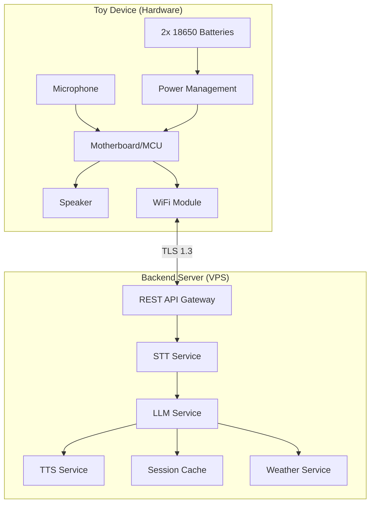
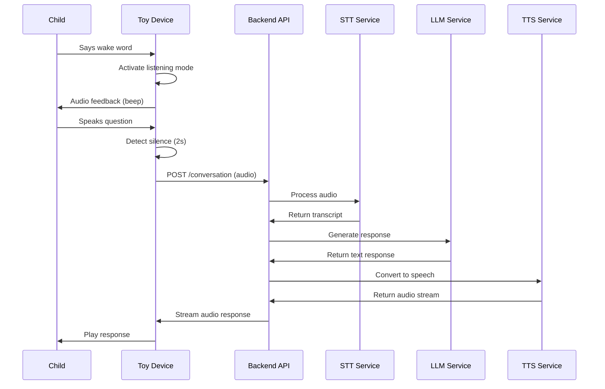

# Design Document: ToToyAI Platform

## Overview

ToToyAI is a complete AI-powered plush toy platform consisting of embedded hardware devices and self-hosted backend services. The system enables natural voice conversations between children and their toys, providing entertainment and educational value through LLM-powered interactions.

The architecture follows a client-server model where the Toy Device handles audio capture/playback and communicates with a VPS-hosted backend that processes speech, generates responses, and synthesizes audio. The system prioritizes child safety, low latency, and GDPR compliance.

## Architecture



### System Flow



## Components and Interfaces

### 1. Toy Device Firmware

**Responsibilities:**

- Wake word detection
- Audio capture and transmission
- Audio playback with streaming support
- Power management and battery monitoring
- WiFi connectivity and reconnection
- Device authentication

**Key Interfaces:**

```c
// Audio capture interface
typedef struct {
    uint8_t* buffer;
    size_t length;
    uint32_t sample_rate;  // 16000 Hz
    uint8_t bit_depth;     // 16-bit
} AudioCapture;

// Device state
typedef enum {
    STATE_IDLE,
    STATE_LISTENING,
    STATE_PROCESSING,
    STATE_PLAYING,
    STATE_SLEEPING,
    STATE_LOW_BATTERY
} DeviceState;
```

### 2. Backend API Gateway

**Responsibilities:**

- Request routing and authentication
- Rate limiting and request validation
- TLS termination
- Error handling and logging

**REST Endpoints:**

```
POST /api/v1/conversation
  - Input: audio (binary), device_id, session_id
  - Output: audio stream (binary)

POST /api/v1/auth/device
  - Input: device_id, device_secret
  - Output: access_token, refresh_token

GET /api/v1/health
  - Output: service status

GET /api/v1/weather?location={location}
  - Output: weather data (JSON)
```

### 3. STT Service

**Responsibilities:**

- Convert audio to text
- Handle various audio qualities
- Support English language with child speech patterns

**Interface:**

```python
class STTService:
    async def transcribe(self, audio: bytes, sample_rate: int) -> TranscriptResult:
        """Convert audio to text."""
        pass

@dataclass
class TranscriptResult:
    text: str
    confidence: float
    language: str
```

### 4. LLM Service

**Responsibilities:**

- Generate child-appropriate responses
- Maintain conversation context
- Content filtering and safety
- Handle specialized features (weather, stories, math)

**Interface:**

```python
class LLMService:
    async def generate_response(
        self,
        prompt: str,
        session_id: str,
        context: ConversationContext
    ) -> LLMResponse:
        """Generate a response to user input."""
        pass

    async def generate_story(
        self,
        theme: Optional[str],
        duration_minutes: int
    ) -> str:
        """Generate an age-appropriate story."""
        pass

@dataclass
class LLMResponse:
    text: str
    intent: str  # weather, story, song, math, general
    requires_followup: bool
```

### 5. TTS Service

**Responsibilities:**

- Convert text to natural speech
- Support streaming audio output
- Provide child-friendly voice profiles

**Interface:**

```python
class TTSService:
    async def synthesize(
        self,
        text: str,
        voice_profile: str = "friendly_child"
    ) -> AsyncIterator[bytes]:
        """Convert text to streaming audio."""
        pass
```

### 6. Session Manager

**Responsibilities:**

- Track conversation context per device
- Handle session timeouts
- Manage memory efficiently

**Interface:**

```python
class SessionManager:
    async def get_context(self, session_id: str) -> ConversationContext:
        pass

    async def update_context(
        self,
        session_id: str,
        user_input: str,
        assistant_response: str
    ) -> None:
        pass

    async def clear_session(self, session_id: str) -> None:
        pass
```

## Data Models

### Device Registration

```json
{
  "device_id": "string (UUID)",
  "device_secret": "string (hashed)",
  "registered_at": "datetime",
  "last_seen": "datetime",
  "firmware_version": "string",
  "owner_email": "string (optional, for GDPR)"
}
```

### Conversation Request

```json
{
  "device_id": "string",
  "session_id": "string",
  "audio_data": "base64 encoded binary",
  "sample_rate": 16000,
  "timestamp": "datetime"
}
```

### Conversation Response

```json
{
  "session_id": "string",
  "transcript": "string",
  "response_text": "string",
  "intent": "string",
  "audio_url": "string (streaming endpoint)",
  "timestamp": "datetime"
}
```

### Weather Data

```json
{
  "location": "string",
  "temperature_celsius": "number",
  "condition": "string",
  "description": "string (child-friendly)",
  "timestamp": "datetime"
}
```

### Session Context

```json
{
  "session_id": "string",
  "device_id": "string",
  "messages": [
    {
      "role": "user | assistant",
      "content": "string",
      "timestamp": "datetime"
    }
  ],
  "current_story": "string (optional)",
  "created_at": "datetime",
  "expires_at": "datetime"
}
```

## Correctness Properties

_A property is a characteristic or behavior that should hold true across all valid executions of a system-essentially, a formal statement about what the system should do. Properties serve as the bridge between human-readable specifications and machine-verifiable correctness guarantees._

### Property 1: Wake Word State Transition

_For any_ device in idle state, when a wake word is detected, the device SHALL transition to listening state and trigger audio feedback.
**Validates: Requirements 1.1**

### Property 2: Silence Detection Terminates Capture

_For any_ audio input stream with a silence gap of 2 or more seconds, the capture process SHALL terminate at the silence boundary.
**Validates: Requirements 1.2**

### Property 3: STT Error Fallback

_For any_ STT processing failure, the system SHALL return a predefined friendly error message rather than crashing or returning empty.
**Validates: Requirements 1.5**

### Property 4: LLM Response Generation

_For any_ valid transcribed text input, the LLM service SHALL produce a non-empty response.
**Validates: Requirements 2.1**

### Property 5: Content Filter Blocks Inappropriate Content

_For any_ response containing known inappropriate patterns (violence, adult themes), the content filter SHALL block or sanitize the content before returning.
**Validates: Requirements 2.3**

### Property 6: Session Context Preservation

_For any_ sequence of messages within a session, the conversation context SHALL contain all previous messages in order when generating the next response.
**Validates: Requirements 2.4**

### Property 7: LLM Error Fallback

_For any_ LLM processing failure, the system SHALL return a predefined friendly fallback message.
**Validates: Requirements 2.5**

### Property 8: TTS Produces Audio Output

_For any_ non-empty text input, the TTS service SHALL produce non-empty audio output.
**Validates: Requirements 3.1**

### Property 9: TTS Error Fallback

_For any_ TTS processing failure, the system SHALL return pre-recorded fallback audio.
**Validates: Requirements 3.5**

### Property 10: Weather Query Returns Data

_For any_ weather query with a valid location, the weather service SHALL return weather data containing temperature and condition.
**Validates: Requirements 4.1**

### Property 11: Temperature in Celsius

_For any_ weather response, temperature values SHALL be in Celsius format (numeric value without Fahrenheit conversion).
**Validates: Requirements 4.3**

### Property 12: Weather Service Error Fallback

_For any_ weather service failure, the system SHALL return an unavailability message rather than crashing.
**Validates: Requirements 4.4**

### Property 13: Story Length Bounds

_For any_ story generation request, the generated story SHALL have a word count between 300 and 750 words (approximately 2-5 minutes when spoken).
**Validates: Requirements 5.1**

### Property 14: Story Continuation Context

_For any_ story continuation request within a session, the continued story SHALL reference elements from the previous story segment.
**Validates: Requirements 5.5**

### Property 15: Song Request Produces Output

_For any_ song request, the system SHALL return either a pre-recorded audio file or generated lyrics with TTS audio.
**Validates: Requirements 6.1, 6.2, 6.3**

### Property 16: Math Answer Correctness

_For any_ basic arithmetic question (addition, subtraction, multiplication, division with integers), the LLM response SHALL contain the mathematically correct answer.
**Validates: Requirements 7.1**

### Property 17: Inappropriate Topic Redirection

_For any_ query about inappropriate topics, the LLM response SHALL redirect to an appropriate subject without providing harmful information.
**Validates: Requirements 7.4**

### Property 18: Battery Notification Thresholds

_For any_ battery level transition below 20% or below 5%, the system SHALL trigger the appropriate notification (warning at 20%, shutdown warning at 5%).
**Validates: Requirements 8.2, 8.3**

### Property 19: Idle Timeout Sleep Mode

_For any_ device idle for 5 minutes, the system SHALL transition to sleep mode.
**Validates: Requirements 8.4**

### Property 20: TLS Encryption Required

_For any_ communication between device and server, the connection SHALL use TLS 1.3 encryption.
**Validates: Requirements 9.1**

### Property 21: Authentication Validation

_For any_ API request, the server SHALL validate device credentials and reject requests with invalid or missing authentication.
**Validates: Requirements 9.2, 9.5**

### Property 22: Request Queue on Disconnect

_For any_ request made during network disconnection, the device SHALL queue the request and retry upon reconnection.
**Validates: Requirements 9.3**

### Property 23: Timeout Notification

_For any_ request exceeding 5 seconds latency, the device SHALL play a waiting message.
**Validates: Requirements 9.4**

### Property 24: Error Logging Completeness

_For any_ server error, the log entry SHALL contain timestamp, error type, request ID, and stack trace.
**Validates: Requirements 10.4**

### Property 25: Audio Data Non-Persistence

_For any_ completed session, audio recordings SHALL be deleted and not retrievable from storage.
**Validates: Requirements 11.1**

### Property 26: PII Request Blocking

_For any_ LLM prompt attempting to extract personal information (name, address, phone, etc.), the system SHALL block the request and not store the attempt.
**Validates: Requirements 11.3**

### Property 27: Safety Concern Logging

_For any_ detected safety concern in conversation, the system SHALL create a log entry without storing the conversation content.
**Validates: Requirements 11.4**

### Property 28: Data Deletion Completeness

_For any_ data deletion request, all associated device data SHALL be removed from all storage systems.
**Validates: Requirements 11.5**

### Property 29: API Response Format

_For any_ API response, the response SHALL include appropriate HTTP status code and JSON-formatted body with required fields.
**Validates: Requirements 12.1, 12.2**

### Property 30: JSON Serialization Round Trip

_For any_ valid request or response object, serializing to JSON and parsing back SHALL produce an equivalent object.
**Validates: Requirements 12.5, 12.6**

### Property 31: API Backward Compatibility

_For any_ request using the previous API version, the server SHALL process it correctly and return a valid response.
**Validates: Requirements 12.4**

## Error Handling

### Device-Side Errors

| Error Type               | Handling Strategy                                                    |
| ------------------------ | -------------------------------------------------------------------- |
| Wake word false positive | Timeout after 5s of no speech, return to idle                        |
| Network unavailable      | Queue request, play "I'll remember that" message, retry on reconnect |
| Network timeout          | Play waiting message, retry up to 3 times, then apologize            |
| Audio playback failure   | Log error, attempt replay once                                       |
| Low battery              | Progressive warnings at 20%, 10%, 5%, graceful shutdown              |

### Server-Side Errors

| Error Type                 | Handling Strategy                                          |
| -------------------------- | ---------------------------------------------------------- |
| STT failure                | Return friendly "please repeat" message                    |
| LLM timeout                | Return cached response if available, else fallback message |
| LLM content filter trigger | Return safe alternative response                           |
| TTS failure                | Return pre-recorded fallback audio                         |
| Weather API failure        | Return "weather unavailable" message                       |
| Database error             | Log, return graceful error, alert admin                    |
| Rate limit exceeded        | Queue request, return "busy" message                       |

### Error Response Format

```json
{
  "error": true,
  "error_code": "string",
  "error_message": "string (user-friendly)",
  "fallback_audio_url": "string (optional)",
  "retry_after": "number (seconds, optional)"
}
```

## Testing Strategy

### Unit Testing

Unit tests will verify specific functionality of individual components:

- **STT Service**: Test transcription with sample audio files
- **LLM Service**: Test response generation, content filtering, intent detection
- **TTS Service**: Test audio generation for various text inputs
- **Session Manager**: Test context storage, retrieval, and expiration
- **API Gateway**: Test routing, authentication, request validation
- **Content Filter**: Test blocking of known inappropriate patterns
- **Weather Service**: Test data retrieval and formatting

### Property-Based Testing

We will use **Hypothesis** (Python) for property-based testing of the backend services. Each property test will run a minimum of 100 iterations.

Property-based tests will be tagged with the format: `**Feature: ai-toy-platform, Property {number}: {property_text}**`

Key property tests:

1. **JSON Round Trip**: For any valid API request/response object, `parse(serialize(obj)) == obj`
2. **Content Filter Completeness**: For any text containing blocked patterns, filter output contains none of those patterns
3. **Session Context Ordering**: For any sequence of messages, context maintains chronological order
4. **Math Correctness**: For any arithmetic expression, LLM answer matches computed result
5. **Error Fallback Consistency**: For any service failure, fallback response is non-empty and user-friendly
6. **Authentication Rejection**: For any invalid credentials, request is rejected with 401 status
7. **Battery State Transitions**: For any battery level sequence, notifications trigger at correct thresholds

### Integration Testing

- End-to-end conversation flow testing
- Device-to-server communication testing
- Multi-turn conversation context testing
- Error recovery and retry testing

### Test Environment

```yaml
# docker-compose.test.yml
services:
  test-runner:
    build: ./tests
    environment:
      - TEST_MODE=true
      - MOCK_LLM=true
      - MOCK_TTS=true
    depends_on:
      - api
      - redis

  api:
    build: ./backend
    environment:
      - ENV=test

  redis:
    image: redis:alpine
```

## Technology Stack

### Backend (VPS)

- **Runtime**: Python 3.11+ with FastAPI
- **LLM**: Ollama with Llama 3.1 or similar open model
- **STT**: Whisper (OpenAI) - self-hosted
- **TTS**: Coqui TTS or Piper TTS - self-hosted
- **Cache**: Redis for session management
- **Database**: SQLite for device registry (PostgreSQL for scale)
- **Container**: Docker + Docker Compose
- **Reverse Proxy**: Nginx with TLS termination

### Firmware (Toy Device)

- **MCU**: ESP32-S3 (WiFi + audio support)
- **Audio Codec**: I2S for microphone and speaker
- **Framework**: ESP-IDF or Arduino
- **Wake Word**: Edge Impulse or custom trained model

### External Services

- **Weather API**: Open-Meteo (free, no API key required)
